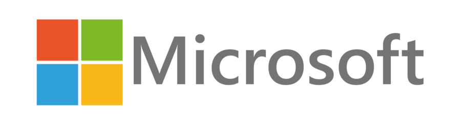

# HackingForHumanity

|[Girls in Tech - Poland](https://poland.girlsintech.org/) |[Microsoft Azure User Group Poland](https://www.facebook.com/groups/azureugpl/) |
|-|-|
 | 

## Azure Pass

During the hackathon, Each team is eligible to use a Microsoft Azure as the platform to deliver your app.

In order to access an MS Azure subscription, Microsoft Poland is handing out **Azure Pass** vouchers with a value of $50 each. which should be sufficient for the duration of the hackathon.

In case the amount is not sufficient, please contact the organizers.

### Accessing the Azure Pass

#### Obtaining the Microsoft Azure Pass Promo Code

In order to obtain your promo code, please contact your mentors.

#### Creating a new Microsoft LiveId Account

> **Important**
>
> In order to access MS Azure pass it is strongly recommended that you do not use your regular MS LiveId, but create a new one.

- Open your preferred web browser 
- Navigate to [live.com](https://www.live.com)
- Create a new **LiveId** account

#### Activating Azure Pass

- Navigate to [microsoftazurepass.com](https://www.microsoftazurepass.com)
- Sign in with your newly created **LiveId**
- Begin the signup process
- Claim your **Azure Pass Promo Code**
- Sign in to the [portal.azure.com](https://portal.azure.com) using your newly created **LiveId**

> **Questions**
>
> Please direct any Azure-related questions at one of your Azure Mentors:
>
> - Marek Grabarz
> - Łukasz Kałuny
> - Adam Marczak
> - Maciej Misztal

## Challenges

### Challenge5

Challenge 5 involves using the Parking data, courtesy of Skanska in order to deliver an app for finding alternative transportation to the working space in the city.

The data provided by Skanska, can be found [here](https://github.com/Girls-in-Tech-Poland/HackingForHumanity/tree/master/data/skanska)

Good Luck